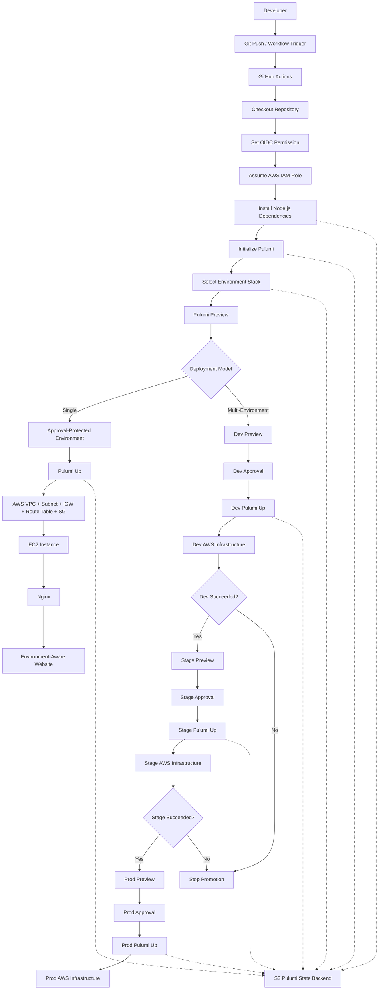
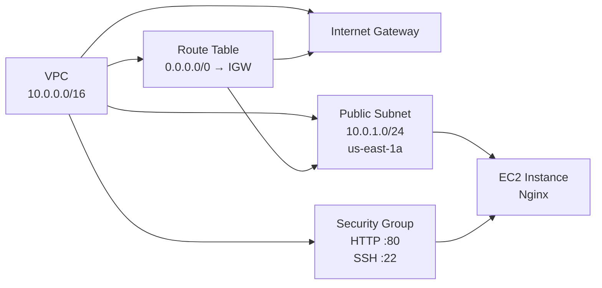

# AWS Multi-Environment Deployment with Pulumi & GitHub Actions

> **Infrastructure as Code, CI/CD, isolated environments, and approval gates — because clicking buttons in the AWS Console is not a deployment strategy. It is a lifestyle choice.**

[](https://aws.amazon.com/)
[](https://www.pulumi.com/)
[](https://www.typescriptlang.org/)
[](https://docs.github.com/en/actions)
[](https://docs.github.com/en/actions/how-tos/secure-your-work/security-harden-deployments/configuring-openid-connect-in-amazon-web-services)
[](#current-status)
[](https://github.com/gourav499/aws-pulumi-github-actions)

---

## Table of Contents

- [Overview](#overview)
- [Project Intent](#project-intent)
- [Core Objectives & Business Value](#core-objectives--business-value)
- [Architecture](#architecture)
- [Deployment Scenarios](#deployment-scenarios)
- [CI/CD Workflow](#cicd-workflow)
- [Manual Approval Model](#manual-approval-model)
- [Technology Stack](#technology-stack)
- [Infrastructure Components](#infrastructure-components)
- [Pulumi Architecture](#pulumi-architecture)
- [Environment & State Strategy](#environment--state-strategy)
- [Repository Structure](#repository-structure)
- [Prerequisites](#prerequisites)
- [Configuration](#configuration)
- [Deployment Runbook](#deployment-runbook)
- [Validation](#validation)
- [Notable Incidents, Errors & Post-Mortems](#notable-incidents-errors--post-mortems)
- [Troubleshooting Matrix](#troubleshooting-matrix)
- [Security Considerations](#security-considerations)
- [Design Decisions](#design-decisions)
- [Operational Guardrails](#operational-guardrails)
- [Current Status](#current-status)
- [Next Phase](#next-phase)
- [Contributing](#contributing)
- [License](#license)
- [References](#references)

---

## Overview

This repository implements an AWS deployment pipeline using:

- **Pulumi** for Infrastructure as Code
- **TypeScript** for the infrastructure program
- **GitHub Actions** for CI/CD orchestration
- **AWS** for networking and compute
- **GitHub OIDC + AWS IAM** for CI/CD authentication
- **Amazon S3** as the Pulumi DIY state backend
- **GitHub Environments + Required Reviewers** for protected deployments

The project was built in two stages.

### Stage 1 — Automated Infrastructure Deployment

The pipeline provisions an EC2-based web environment with Nginx and exposes deployment metadata such as:

- Environment
- Instance ID
- Instance type
- Public IP
- Private IP
- AWS region

### Stage 2 — Multi-Environment Promotion + Approval

The pipeline was extended to model:

```text
Dev → Stage → Prod
```

with environment-specific infrastructure and job dependencies.

The promotion rule is deliberately boring:

```text
Dev succeeds
    ↓
Stage is allowed to run
    ↓
Stage succeeds
    ↓
Prod is allowed to run
```

Then manual approval was introduced so a protected environment can pause the pipeline before `Pulumi Up`.

---

## Project Intent

## What we intended to build

The original requirement was straightforward:

> Automate AWS infrastructure provisioning with Pulumi and move the deployment process into GitHub Actions.

The practical target was:

```text
Developer
   │
   │ git push
   ▼
GitHub Repository
   │
   ▼
GitHub Actions
   │
   ▼
Pulumi
   │
   ▼
AWS Infrastructure
   │
   ▼
EC2
   │
   ▼
Nginx
   │
   ▼
Website
```

The project then evolved into a more realistic delivery workflow:

```text
                 ┌─────────────┐
                 │ Git Push    │
                 └──────┬──────┘
                        │
                        ▼
                ┌───────────────┐
                │ GitHub Actions│
                └──────┬────────┘
                       │
                       ▼
                  Pulumi Preview
                       │
          ┌────────────┴────────────┐
          │                         │
          ▼                         ▼
       Single                  Multi-Environment
          │                         │
          ▼                         ▼
      Pulumi Up              Dev → Stage → Prod
          │                         │
          └────────────┬────────────┘
                       ▼
                  AWS Hosting
```

The real objective was **repeatability**.

Not:

> "Can we make an EC2 instance?"

AWS Console can answer that question before breakfast.

The real question was:

> "Can infrastructure be defined in version control, previewed, deployed, promoted between environments, protected with approval, and recreated consistently?"

---

## Core Objectives & Business Value

## Objectives

| Objective | Implementation |
|---|---|
| Infrastructure as Code | Pulumi + TypeScript |
| AWS provisioning | VPC, subnet, routing, security group, EC2 |
| Web hosting | Nginx on EC2 |
| CI/CD | GitHub Actions |
| AWS authentication | GitHub OIDC + IAM role |
| State management | S3 Pulumi backend |
| Environment separation | Dev / Stage / Prod |
| Deployment sequencing | GitHub Actions `needs` dependencies |
| Change visibility | `pulumi preview` |
| Deployment governance | GitHub Environments + Required Reviewers |
| Reusability | Pulumi component functions |
| Configuration | Pulumi stack configuration |

## Business value

### Before

```text
Manual infrastructure
        +
Manual deployment sequence
        +
Repeated configuration
        +
Human memory
        +
Long-lived credential temptation
```

### After

```text
Version-controlled infrastructure
        +
Automated execution
        +
Environment-specific configuration
        +
Deterministic promotion rules
        +
Short-lived CI/CD identity
        +
Explicit approval gates
```

The value is not simply "automation."

It is **controlled automation**:

- repeatable
- reviewable
- traceable
- environment-aware
- less dependent on somebody remembering which AWS console tab they changed last Tuesday

---

## Architecture

## End-to-End Pipeline



## Infrastructure Topology

The implemented Pulumi program composes reusable networking and compute functions:



---

## Deployment Scenarios

## Scenario 1 — Single Deployment

The single deployment is the baseline implementation.

### Flow

```text
Git Push
   │
   ▼
GitHub Actions
   │
   ├── Checkout
   ├── AWS OIDC authentication
   ├── Install dependencies
   ├── Select Pulumi stack
   ├── Pulumi Preview
   ├── Approval gate
   └── Pulumi Up
          │
          ▼
       AWS VPC
          │
          ├── Subnet
          ├── Internet Gateway
          ├── Route Table
          └── Security Group
                  │
                  ▼
                EC2
                  │
                  ▼
                Nginx
                  │
                  ▼
          Environment-aware page
```

The page generated by the EC2 bootstrap script includes:

```text
Environment
Instance ID
Instance Type
Public IP
Private IP
Region
```

The current implementation retrieves instance metadata from the EC2 Instance Metadata Service and writes the resulting values into the Nginx HTML page.

---

## Scenario 2 — Dev → Stage → Prod

The second scenario introduces promotion between environments.

```text
                    ┌───────────┐
                    │    Dev    │
                    └─────┬─────┘
                          │
                     success only
                          │
                          ▼
                    ┌───────────┐
                    │   Stage   │
                    └─────┬─────┘
                          │
                     success only
                          │
                          ▼
                    ┌───────────┐
                    │   Prod    │
                    └───────────┘
```

The intended GitHub Actions dependency model is:

```yaml
stage:
  needs: dev

prod:
  needs:
    - dev
    - stage
```

GitHub Actions uses `needs` to establish job dependencies; a dependent job is skipped when a required job fails or is skipped unless a condition explicitly changes that behavior. citeturn593236search4turn593236search6

That behavior is useful here because it turns the pipeline into an explicit promotion graph instead of three independent jobs politely hoping for the best.

---

## CI/CD Workflow

## Standard Deployment Flow

```text
┌──────────────────────┐
│ GitHub Push / Event  │
└──────────┬───────────┘
           │
           ▼
┌──────────────────────┐
│ Checkout Repository  │
└──────────┬───────────┘
           │
           ▼
┌──────────────────────┐
│ AWS OIDC             │
│ Assume IAM Role      │
└──────────┬───────────┘
           │
           ▼
┌──────────────────────┐
│ Node + npm           │
│ Pulumi dependencies  │
└──────────┬───────────┘
           │
           ▼
┌──────────────────────┐
│ Select Pulumi Stack  │
└──────────┬───────────┘
           │
           ▼
┌──────────────────────┐
│   pulumi preview     │
└──────────┬───────────┘
           │
           ▼
┌──────────────────────┐
│ Environment Approval  │
│ when protection set   │
└──────────┬───────────┘
           │
           ▼
┌──────────────────────┐
│     pulumi up        │
└──────────┬───────────┘
           │
           ▼
┌──────────────────────┐
│ AWS Infrastructure   │
└──────────────────────┘
```

## Why `preview` before `up`?

`pulumi preview` provides a proposed infrastructure change set.

`pulumi up` performs the update.

Keeping the two phases distinct provides a clean control point:

```text
Preview
   │
   ▼
Review
   │
   ▼
Approve
   │
   ▼
Up
```

That is a considerably nicer operating model than:

```text
Up
   │
   ▼
Something changed
   │
   ▼
Why is production different?
   │
   ▼
Open incident ticket
```

---

## Manual Approval Model

The second phase adds **GitHub Environments** and **Required Reviewers**.

GitHub environment protection rules are evaluated before a job referencing that environment proceeds; required reviewers can pause the job until approval. citeturn832838search0turn832838search2

## Single deployment

```text
Pulumi Preview
      │
      ▼
┌────────────────────┐
│ Protected GitHub   │
│ Environment        │
│ Required Reviewer  │
└─────────┬──────────┘
          │
      Approved
          │
          ▼
      Pulumi Up
          │
          ▼
      AWS Deploy
```

## Multi-environment

```text
Dev Preview
    │
    ▼
Dev Approval
    │
    ▼
Dev Up
    │
    ▼
Stage Preview
    │
    ▼
Stage Approval
    │
    ▼
Stage Up
    │
    ▼
Prod Preview
    │
    ▼
Prod Approval
    │
    ▼
Prod Up
```

The important implementation detail is that the **deployment job containing `Pulumi Up` must reference the protected environment**. Putting an approval somewhere else in the workflow while the real apply runs in an unprotected job would be governance theater, not governance.

GitHub documents that a job referencing an environment waits for its protection rules before it starts, and environment secrets are only available after those rules pass. citeturn832838search0turn832838search5

---

## Technology Stack

| Layer | Technology | Role |
|---|---|---|
| Cloud | AWS | Infrastructure platform |
| Compute | Amazon EC2 | Application host |
| Networking | Amazon VPC | Network boundary |
| Networking | Subnet | EC2 placement |
| Networking | Internet Gateway | Internet connectivity |
| Networking | Route Table | Default internet route |
| Security | Security Group | SSH/HTTP traffic control |
| Web | Nginx | Web server |
| IaC | Pulumi | Infrastructure provisioning |
| IaC Language | TypeScript | Pulumi implementation |
| CI/CD | GitHub Actions | Workflow execution |
| Identity | GitHub OIDC | Federated CI/CD identity |
| Identity | AWS IAM | Trust + permissions |
| State | Amazon S3 | Pulumi DIY backend |
| Runtime | Node.js | TypeScript execution |
| Package Manager | npm | Dependency management |
| SCM | Git / GitHub | Version control |

---

## Infrastructure Components

## VPC

The VPC component currently defines:

```text
CIDR: 10.0.0.0/16
DNS Hostnames: enabled
DNS Support: enabled
```

## Public Subnet

The subnet component currently uses:

```text
CIDR: 10.0.1.0/24
Availability Zone: us-east-1a
Map Public IP On Launch: true
```

## Internet Gateway

The VPC is associated with an Internet Gateway for public connectivity.

## Route Table

The route table contains:

```text
0.0.0.0/0 → Internet Gateway
```

and is explicitly associated with the public subnet.

## Security Group

The current implementation allows:

```text
TCP 22 → 0.0.0.0/0
TCP 80 → 0.0.0.0/0
All egress → 0.0.0.0/0
```

> **Lab warning:** SSH from `0.0.0.0/0` is intentionally permissive for this exercise and should not be copied into a production security baseline. Restrict SSH to a trusted CIDR, VPN, bastion, SSM, or equivalent controlled access path.

## EC2

The EC2 component consumes:

```text
subnetId
securityGroupId
environment
instanceType
```

The current code uses a pinned AMI:

```text
ami-0b2c9d1f3edcfd709
```

and boots Nginx using cloud-init/user data.

## Nginx bootstrap

The instance bootstrap:

1. Installs Nginx with `dnf`.
2. Queries the EC2 metadata service.
3. Retrieves public/private IP, instance ID, and instance type.
4. Generates `/usr/share/nginx/html/index.html`.
5. Enables Nginx.
6. Starts Nginx.

---

## Pulumi Architecture

The Pulumi project uses a layered structure rather than putting every AWS resource into one heroic TypeScript file.

```text
pulumi/
└── hjinfotech-infrastructure/
    ├── index.ts
    ├── Pulumi.yaml
    ├── Pulumi.dev-app1.yaml
    ├── package.json
    ├── components/
    │   ├── compute/
    │   │   └── ec2.ts
    │   └── network/
    │       ├── internetGateway.ts
    │       ├── routeTable.ts
    │       ├── securityGroup.ts
    │       ├── subnet.ts
    │       └── vpc.ts
    └── stacks/
        └── app1.ts
```

## Composition model

The stack file composes reusable functions:

```text
stacks/app1.ts
    │
    ├── createVpc()
    ├── createInternetGateway()
    ├── createSubnet()
    ├── createRouteTable()
    ├── createSecurityGroup()
    └── createEc2()
             │
             ▼
          index.ts
             │
             └── exports stack outputs
```

The root program exports:

```text
vpcId
subnetId
routeTableId
securityGroupId
instanceId
publicIp
instanceType
```

This is intentionally simple, but it establishes the pattern needed to evolve toward shared components and stronger environment abstraction later.

---

## Environment & State Strategy

## Environment configuration

Stack-specific configuration is kept in Pulumi stack settings.

The current Dev configuration includes:

```yaml
aws:region: us-east-1
environment: dev
instanceType: t3.micro
applicationArea: app1
```

The Pulumi stack configuration model is designed for exactly this kind of environment-specific variation rather than hardcoding values into the infrastructure program. citeturn593236search2turn593236search0

## S3 backend

The selected Pulumi backend is:

```text
s3://aws-pulumi-github-actions-state
```

The important distinction:

```text
GitHub
└── TypeScript + YAML + workflow source

AWS S3
└── Pulumi state
```

S3 stores infrastructure state; it is not a second Git repository for the Pulumi source.

Pulumi supports self-managed object-storage backends such as S3 through `pulumi login <backend-url>`. citeturn832838search9

## Stack model

The project uses stacks to represent environment/application instances.

A representative model is:

```text
S3 Backend
│
└── Pulumi State
    ├── dev-app1
    ├── stage-app1
    └── prod-app1
```

The exact stack set should match the environments actually configured in the workflow.

---

## Repository Structure

The current repository separates CI/CD and Pulumi infrastructure:

```text
aws-pulumi-github-actions/
│
├── .github/
│   └── workflows/
│       └── <deployment-workflows>.yml
│
├── pulumi/
│   └── hjinfotech-infrastructure/
│       ├── index.ts
│       ├── Pulumi.yaml
│       ├── Pulumi.dev-app1.yaml
│       ├── package.json
│       ├── components/
│       │   ├── compute/
│       │   │   └── ec2.ts
│       │   └── network/
│       │       ├── internetGateway.ts
│       │       ├── routeTable.ts
│       │       ├── securityGroup.ts
│       │       ├── subnet.ts
│       │       └── vpc.ts
│       └── stacks/
│           └── app1.ts
│
├── .gitignore
└── README.md
```

Workflow filenames are intentionally shown generically here because the workflow layer is the part currently targeted for standardization and reduction of duplication.

---

## Prerequisites

## Local tooling

Install:

- Git
- Node.js
- npm
- Pulumi CLI
- AWS CLI

The implementation environment used during the project included:

```text
Node.js: v24.21.0
npm:     11.19.0
AWS:     us-east-1
```

These are the versions/region used during development, not hard requirements for the architecture.

## AWS prerequisites

You need:

- An AWS account
- IAM permissions sufficient to create the project's resources
- An S3 bucket for the Pulumi backend
- A GitHub OIDC identity provider configured in AWS
- An IAM role trusted by GitHub Actions
- Permissions on that role for the AWS resources Pulumi manages

GitHub's AWS OIDC integration requires an IAM trust relationship that limits which GitHub identities can assume the role; GitHub recommends restricting the `sub` claim to the intended repository/branch or environment. citeturn832838search1turn555658search1

---

## Configuration

## Pulumi backend

Authenticate to the S3 backend:

```bash
pulumi login s3://aws-pulumi-github-actions-state
```

You can also persist the backend choice through `PULUMI_BACKEND_URL`. citeturn832838search9turn593236search3

## Stack initialization

Example:

```bash
pulumi stack init dev-app1
```

Select an existing stack:

```bash
pulumi stack select dev-app1
```

## Pulumi configuration

Example:

```bash
pulumi config set aws:region us-east-1
pulumi config set environment dev
pulumi config set instanceType t3.micro
```

For sensitive configuration:

```bash
pulumi config set --secret <key> <value>
```

Pulumi stack configuration supports encrypted secret values when configured with a supported secrets provider. citeturn593236search1

## Passphrase-based secrets

This project encountered Pulumi passphrase handling during setup. When using passphrase-based encryption, the same passphrase must be available to the operator/runner that needs to decrypt the stack configuration/state.

Pulumi supports `PULUMI_CONFIG_PASSPHRASE` for this purpose. citeturn593236search3

---

## Deployment Runbook

## 1. Clone

```bash
git clone https://github.com/gourav499/aws-pulumi-github-actions.git
cd aws-pulumi-github-actions
```

## 2. Enter the Pulumi project

```bash
cd pulumi/hjinfotech-infrastructure
```

## 3. Install dependencies

```bash
npm install
```

## 4. Verify AWS identity locally

```bash
aws sts get-caller-identity
```

## 5. Login to Pulumi S3 backend

```bash
pulumi login s3://aws-pulumi-github-actions-state
```

## 6. Select the target stack

```bash
pulumi stack select dev-app1
```

## 7. Preview

```bash
pulumi preview
```

Review the planned resources carefully.

Expected categories include:

```text
VPC
Subnet
Internet Gateway
Route Table
Route Table Association
Security Group
EC2 Instance
```

## 8. Deploy

For a local deployment:

```bash
pulumi up
```

For non-interactive CI/CD, the workflow should invoke the equivalent deployment operation without waiting for a terminal confirmation.

---

## Triggering the GitHub Actions Pipeline

The workflow trigger is defined in the repository under:

```text
.github/workflows/
```

The supported trigger model should be checked in the workflow itself. Typical GitHub Actions deployment triggers include:

```text
push
pull_request
workflow_dispatch
```

GitHub supports repository events such as `push`, `pull_request`, and `workflow_dispatch` for workflow execution. citeturn832838search0

For this project, the operational intent is:

```text
Code change
   ↓
Workflow starts
   ↓
Preview
   ↓
Approval when protected
   ↓
Deployment
```

## Manual workflow execution

When `workflow_dispatch` is enabled, the workflow can be started from:

```text
GitHub Repository
  → Actions
  → Select workflow
  → Run workflow
```

---

## GitHub OIDC Setup

The workflow needs permission to request an OIDC token:

```yaml
permissions:
  id-token: write
  contents: read
```

GitHub documents `id-token: write` as the permission required for a workflow/job to request an OIDC JWT; this does not itself grant AWS resource permissions. citeturn832838search1turn593236search5

The AWS side requires:

```text
GitHub OIDC Provider
        │
        ▼
IAM Trust Policy
        │
        ▼
GitHub Actions Assumes Role
        │
        ▼
Temporary AWS Credentials
        │
        ▼
Pulumi
```

The recommended trust model is to constrain the role to the intended GitHub repository and deployment context rather than trusting arbitrary repositories. citeturn555658search1turn555658search7

---

## Validation

## Pulumi validation

```bash
pulumi stack
pulumi stack output
pulumi preview
```

## AWS validation

Verify:

```text
VPC
Subnet
Internet Gateway
Route Table
Route Table Association
Security Group
EC2 Instance
```

## EC2 validation

On the host:

```bash
systemctl status nginx
```

Check:

```bash
curl http://localhost
```

From a client with network access:

```bash
curl http://<PUBLIC_IP>
```

The rendered page should show the correct:

```text
Environment
Instance ID
Instance Type
Public IP
Private IP
Region
```

---

## Notable Incidents, Errors & Post-Mortems

Real infrastructure projects usually contain at least one moment where the cloud politely explains that your assumptions were fictional.

This project had those moments too.

## Incident 01 — Pulumi Passphrase Error

### Symptom

Pulumi failed during setup because the stack required passphrase-based configuration/state decryption and the expected passphrase was not correctly available.

### Impact

The stack could not proceed normally until the secrets configuration could be unlocked.

### Resolution

The Pulumi passphrase configuration was corrected, after which:

```bash
pulumi preview
pulumi up
```

completed successfully.

### Root cause

The infrastructure itself was not the problem.

The state/secrets bootstrap path was incomplete.

### Lesson

Treat these as separate concerns:

```text
Cloud authentication
        ≠
Pulumi backend authentication
        ≠
Pulumi secrets decryption
```

A valid AWS login does not automatically mean Pulumi can unlock encrypted stack data.

---

## Incident 02 — IAM / OIDC Authorization Boundary

The deployment architecture depends on two separate IAM controls:

```text
1. Trust policy
   "Who may assume this role?"

2. Permissions policy
   "What may the assumed role do?"
```

These are different problems and must be debugged separately.

### Typical failure patterns

```text
OIDC token cannot be exchanged
        ↓
Trust policy / OIDC configuration issue
```

versus:

```text
Role assumed successfully
        ↓
AWS API returns AccessDenied
        ↓
Permissions policy issue
```

### Resolution model

For OIDC trust failures:

1. Confirm the GitHub OIDC provider exists in AWS IAM.
2. Confirm the workflow has `id-token: write`.
3. Verify the IAM trust policy matches the intended repository/branch/environment claim.
4. Confirm the audience condition is correct.

For AWS permission failures:

1. Confirm the intended IAM role was assumed.
2. Run:

   ```bash
   aws sts get-caller-identity
   ```

3. Identify the exact denied AWS action.
4. Add only the required IAM permission.
5. Re-run `pulumi preview` before attempting `pulumi up`.

GitHub's documentation and AWS guidance both emphasize constraining the OIDC trust relationship rather than allowing unrestricted repository access. citeturn832838search1turn555658search1

> **Incident record note:** The project history confirms the authentication architecture and permission boundary as part of the implementation, but an exact `AccessDenied` log line was not retained in the available project record. This README therefore documents the verified failure modes and resolution procedure without fabricating an error message.

---

## Incident 03 — Approval Gate Placement

### Problem

Manual approval is only meaningful when it controls the job that performs the actual infrastructure mutation.

### Bad model

```text
Preview
  ↓
Approval
  ↓
Unprotected deployment job
  ↓
Pulumi Up
```

### Correct model

```text
Preview
  ↓
Protected environment job
  ↓
Approval
  ↓
Pulumi Up
```

### Lesson

A deployment gate is only a gate if the deployment has to pass through it.

GitHub environments apply protection rules to jobs that reference the environment. citeturn832838search0turn832838search5

---

## Incident 04 — Environment Sequencing Logic

The chained pipeline requires:

```text
Stage depends on Dev
Prod depends on Dev + Stage
```

This is a control-plane dependency, not merely an ordering preference.

### Lesson

Use explicit GitHub Actions job dependencies:

```yaml
needs: dev
```

and:

```yaml
needs:
  - dev
  - stage
```

GitHub's `needs` mechanism makes the dependency graph explicit and prevents downstream jobs from proceeding after an upstream failure/skip under normal dependency semantics. citeturn593236search4

---

## Troubleshooting Matrix

| Symptom | Likely Cause | First Check | Corrective Action |
|---|---|---|---|
| `pulumi preview` asks for/unlocks passphrase | Stack uses passphrase encryption | Pulumi stack settings | Provide the correct passphrase/config secret |
| GitHub cannot obtain AWS credentials | OIDC misconfiguration | Workflow `permissions`, IAM OIDC provider, trust policy | Fix OIDC permission/trust conditions |
| `AccessDenied` from AWS | IAM permission missing | `aws sts get-caller-identity` + denied action | Add only required permission to the assumed role |
| Stack not found | Wrong stack/backend | `pulumi whoami`, `pulumi stack ls` | Login to correct backend and select correct stack |
| Pulumi sees unexpected changes | Code/config/state drift | `pulumi preview` | Review changed inputs and state |
| Stage does not run | Dev failed/skipped | GitHub Actions dependency graph | Fix Dev before promotion |
| Prod does not run | Dev or Stage failed/skipped | GitHub Actions dependency graph | Fix upstream environment |
| Approval not requested | Deployment job does not reference protected environment | Workflow job definition | Attach the correct GitHub Environment |
| EC2 is running but page is unavailable | Network/Nginx/bootstrap issue | SG, route table, `systemctl status nginx` | Fix connectivity or bootstrap |
| Website shows wrong environment | Incorrect stack/config value | `pulumi config`, workflow variables | Correct environment-specific configuration |

---

## Security Considerations

## 1. Prefer OIDC over long-lived AWS keys

GitHub OIDC removes the need to store long-lived AWS credentials as GitHub secrets and instead enables temporary credentials through an AWS IAM role. citeturn832838search1turn555658search12

## 2. Scope the OIDC trust policy

Do not create a trust relationship equivalent to:

```text
"Trust anything GitHub sends us."
```

Restrict the `sub` claim to the intended repository and deployment context. AWS explicitly recommends this restriction. citeturn555658search1turn555658search7

## 3. Minimize IAM permissions

The GitHub Actions role should have only the AWS permissions required by Pulumi.

Avoid:

```text
AdministratorAccess
```

unless this is a temporary isolated lab account and the trade-off is understood.

## 4. Protect production with GitHub Environments

Required reviewers provide a human approval control before protected deployment jobs proceed. citeturn832838search10turn832838search2

## 5. Treat Pulumi state as sensitive infrastructure data

Pulumi state may contain resource information and, depending on the program, sensitive values. Use appropriate backend access controls and secret encryption. citeturn593236search1

## 6. Restrict SSH

Current lab security group rules expose SSH to:

```text
0.0.0.0/0
```

This should be tightened for production.

A production-oriented alternative could be:

```text
Developer/VPN/SSM
        ↓
Private access path
        ↓
EC2
```

rather than exposing TCP/22 globally.

---

## Design Decisions

## Why Pulumi?

The project already had Terraform knowledge, making Pulumi useful for learning how Infrastructure as Code changes when infrastructure definitions are written in a general-purpose language.

The core comparison is:

```text
Terraform
   └── HCL

Pulumi
   └── TypeScript
```

The latter makes familiar programming constructs available to infrastructure code.

## Why TypeScript?

The project uses TypeScript to implement Pulumi resources and reusable infrastructure functions.

That enables:

- Functions
- Variables
- Objects
- Conditions
- Resource references
- Reusable modules

The downside is equally honest:

> Once infrastructure becomes real code, congratulations — your infrastructure can now inherit real code problems.

## Why GitHub Actions?

The source lives in GitHub, so using GitHub Actions keeps CI/CD close to the code and allows workflow control, environment protection, and deployment history in one platform.

## Why S3 for Pulumi state?

A self-managed S3 backend keeps state in AWS and allows CI/CD runners to access persistent state without tying the workflow to a local filesystem. Pulumi supports S3-backed DIY state through its backend mechanism. citeturn832838search9

## Why separate environments?

Environment isolation gives the pipeline a controlled promotion path:

```text
Dev
 ↓
Stage
 ↓
Prod
```

Each environment can carry different configuration and infrastructure characteristics.

## Why approval gates?

Automation is good at execution.

Approval is useful when a change reaches an environment where someone needs to consciously accept the blast radius.

This produces:

```text
Automation
   +
Governance
   =
Controlled delivery
```

---

## Operational Guardrails

The following controls should remain intact during workflow refactoring.

### Never remove

- Dev → Stage dependency
- Stage → Prod dependency
- `pulumi preview`
- Protected environment approval
- OIDC authentication
- Environment-specific configuration
- Remote state
- Explicit production control

### Refactoring objective

The next pipeline iteration should aim for:

```text
Current workflow
      │
      ▼
Remove duplication
      │
      ▼
Centralize repeated setup
      │
      ▼
Parameterize environment differences
      │
      ▼
Preserve every deployment behavior
```

The goal is not:

> "Make the YAML shorter."

The goal is:

> **"Make the YAML smaller without making the architecture dumber."**

---

## Current Status

## Completed

- [x] Pulumi AWS infrastructure provisioning
- [x] TypeScript Pulumi program
- [x] Modular Pulumi component structure
- [x] VPC creation
- [x] Public subnet creation
- [x] Internet Gateway
- [x] Route table + association
- [x] Security group
- [x] EC2 deployment
- [x] Nginx installation
- [x] Environment-aware website
- [x] Pulumi S3 backend
- [x] GitHub Actions CI/CD
- [x] GitHub OIDC → AWS IAM authentication
- [x] Dev → Stage → Prod sequencing
- [x] Environment-specific configuration
- [x] `pulumi preview`
- [x] Manual approval using GitHub Environments
- [x] Required Reviewer protection
- [x] Approval-gated deployment
- [x] Troubleshooting and operational documentation

---

## Next Phase

The next engineering task is to **standardize and optimize the main GitHub Actions workflow**.

## Refactoring goals

```text
Reduce duplication
       ↓
Improve readability
       ↓
Centralize common steps
       ↓
Parameterize environment differences
       ↓
Preserve current behavior
```

The refactor must **not**:

- remove current deployment scenarios
- remove manual approvals
- bypass environment protection
- change Dev → Stage → Prod dependencies
- replace OIDC with long-lived credentials
- break Pulumi state handling
- silently alter infrastructure behavior

Potential implementation techniques include:

- reusable workflows
- composite actions
- shared environment variables
- workflow inputs
- matrix strategies where semantics remain clear
- environment-specific configuration instead of duplicated YAML

Pulumi's current GitHub Actions guidance also supports reusable patterns and highlights concurrency considerations for infrastructure deployments. citeturn653533search0

---

## Contributing

Contributions are welcome, provided they improve the infrastructure rather than merely increase the number of YAML lines.

## Recommended contribution flow

```text
Fork
  ↓
Create feature branch
  ↓
Modify infrastructure/workflow
  ↓
Run formatting + validation
  ↓
Run pulumi preview
  ↓
Review changes
  ↓
Open Pull Request
```

### Before opening a PR

Please verify:

- Pulumi code compiles
- workflow YAML is valid
- environment dependencies still work
- `pulumi preview` is understood
- no secrets or credentials were committed
- IAM permissions remain least-privilege
- production approval gates remain enforced

### Important

Infrastructure pull requests are not documentation edits.

A one-line IaC change can create or destroy actual AWS resources.

Please review accordingly.

---

## License

No open-source license is currently declared for this repository.

Until a license is added, the repository should not be treated as granting broad rights to reuse, redistribute, or modify the source beyond the permissions provided by applicable law and GitHub's hosting terms.

> **Translation:** lack of a license is not the same thing as "MIT, but vibes." Add an explicit license before treating this as a reusable open-source project.

---

## References

Official documentation used to verify the implementation model and operational guidance:

- [GitHub Actions — Deploying with Environments](https://docs.github.com/en/actions/how-tos/deploy/configure-and-manage-deployments/control-deployments)
- [GitHub Actions — OIDC in AWS](https://docs.github.com/en/actions/how-tos/secure-your-work/security-harden-deployments/configuring-openid-connect-in-amazon-web-services)
- [GitHub Actions — Reviewing Deployments](https://docs.github.com/en/actions/how-tos/deploy/configure-and-manage-deployments/review-deployments)
- [GitHub Actions — Workflow Job Dependencies](https://docs.github.com/en/actions/how-tos/write-workflows/choose-what-workflows-do/use-jobs)
- [AWS IAM — Create a Role for OIDC Federation](https://docs.aws.amazon.com/IAM/latest/UserGuide/id_roles_create_for-idp_oidc.html)
- [AWS IAM — OIDC Federation](https://docs.aws.amazon.com/IAM/latest/UserGuide/id_roles_providers_oidc.html)
- [Pulumi — State and Backends](https://www.pulumi.com/docs/iac/concepts/state-and-backends/)
- [Pulumi — Configuration](https://www.pulumi.com/docs/iac/concepts/config/)
- [Pulumi — Secrets Handling](https://www.pulumi.com/docs/iac/concepts/secrets/)
- [Pulumi — GitHub Actions](https://www.pulumi.com/docs/iac/operations/continuous-delivery/github-actions/)

---

## Repository

[github.com/gourav499/aws-pulumi-github-actions](https://github.com/gourav499/aws-pulumi-github-actions)

## Author

**Gourav Tiwari**

> *Funny how a quick task spirals. What was supposed to be a basic EC2 deployment turned into building a massive automated ecosystem—complete with IaC, CI/CD, OIDC, strict multi-environment approvals, and a mild obsession with proper YAML indentation.*
